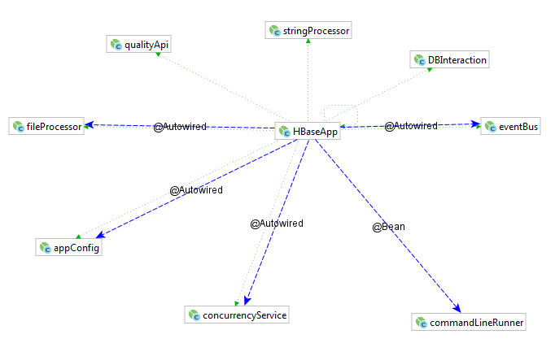

## HBase Check and Load 

#### Generate sample data
```python
with open('C:\\Users\\AF55267\\Documents\\anthem\\source\\hbase_interact\\src\\main\\resources\\sample_10k_hbase.csv','+w') as f:
    for i in range(10000):
        f.write(''.join(random.choice(string.ascii_uppercase + string.digits) for _ in range(40))+"\n")
```

#### Preparation
Clean out the HBase table,
```sql
hbase shell
> truncate 'dv_hb_bdfrawz_nogbd_r1a_wh:voyager_dq'
```

#### Architecture

